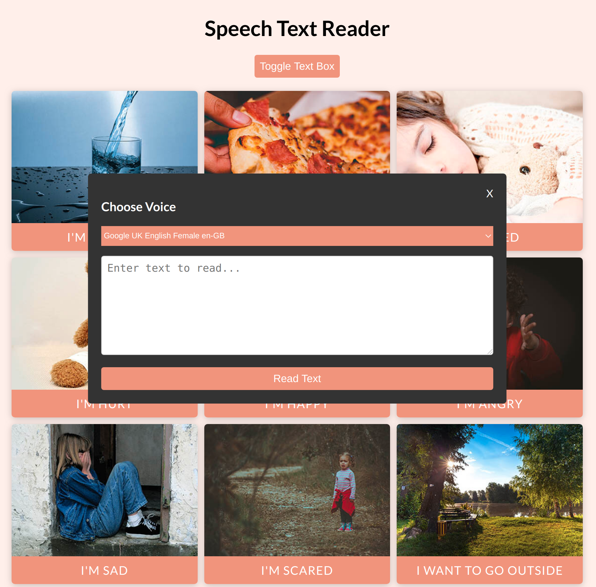

# speech-text-reader

A simple text reader app, built using vanilla JavaScript

### Functions:

[The app](https://tn-space.github.io/speech-text-reader/)

The app:

- toggles button to show and hide custom text box
- takes input text and speaks it.

### Images:

